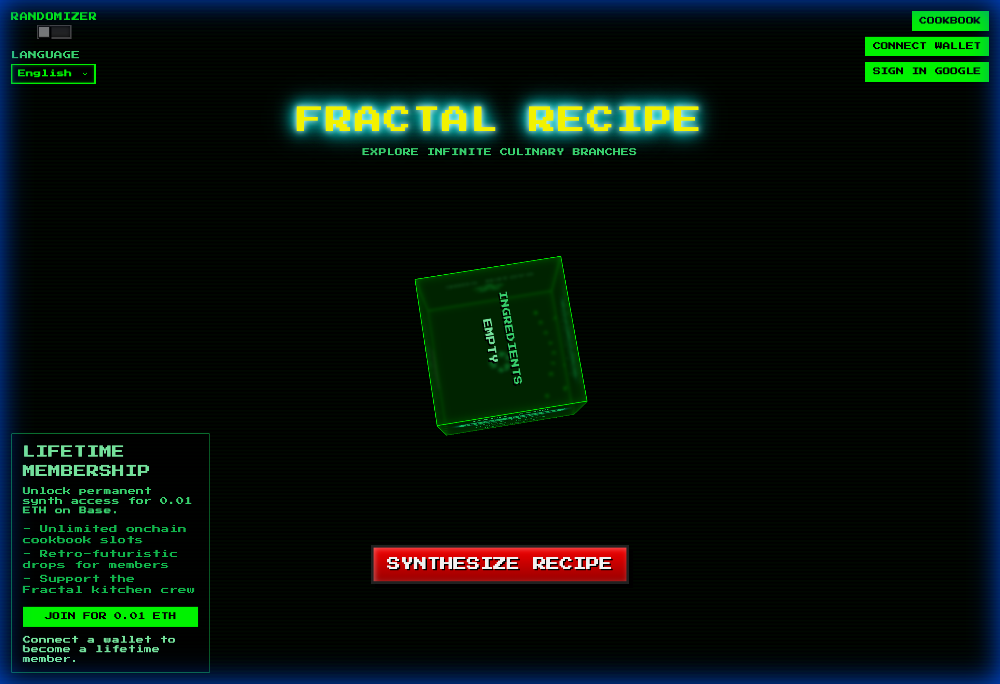

# Fractal Recipe Generator



## Overview

**Fractal Recipe Generator** is an innovative web application that bridges the gap between mathematical beauty and culinary creativity. By leveraging the complexity of fractal algorithms, this tool generates unique, procedurally generated recipes that are as visually stunning as they are delicious.

We built this project to explore the intersection of **generative AI**, **blockchain technology**, and **modern web development**. It serves as a playground for experimenting with decentralized identity (via WalletConnect and Coinbase OnchainKit) and AI-driven content generation (via Google GenAI).

## Key Features

- **Generative Recipes**: Create unique recipes using advanced fractal algorithms and AI.
- **Decentralized Identity**: Seamlessly sign in using your crypto wallet (Metamask, Coinbase Wallet, etc.).
- **AI-Powered Customization**: Tweak and perfect your recipes with the help of Google's Gemini AI.
- **Secure Authentication**: Hybrid auth system supporting both Web3 wallets and traditional email/password login.
- **Modern UI/UX**: A responsive, dark-themed interface built with React and Tailwind CSS (implied style).

## Tech Stack

This project is built with a robust, modern tech stack designed for performance and scalability:

- **Frontend**: [React](https://react.dev/) (v18), [Vite](https://vitejs.dev/)
- **Languages**: TypeScript, JavaScript
- **Styling**: CSS Modules / Custom CSS
- **State Management**: [TanStack Query](https://tanstack.com/query/latest)
- **Web3 & Blockchain**: [Wagmi](https://wagmi.sh/), [Viem](https://viem.sh/), [Coinbase OnchainKit](https://onchainkit.xyz/)
- **AI Integration**: [Google GenAI SDK](https://ai.google.dev/)
- **Backend**: Node.js, Express
- **Database & Auth**: Firebase (Firestore, Auth), Argon2 for hashing

## Getting Started

Follow these steps to set up the project locally on your machine.

### Prerequisites

- Node.js (v18 or higher)
- npm or yarn
- A Firebase project (for authentication and database)

### Installation

1. **Clone the repository:**

    ```bash
    git clone https://github.com/MStarRobotics/Fractal-Recipe-Generator.git
    cd Fractal-Recipe-Generator
    ```

2. **Install dependencies:**

    ```bash
    npm install
    ```

3. **Environment Setup:**
    Create a `.env` file in the root directory and add your API keys:

    ```env
    VITE_GOOGLE_GENAI_API_KEY=your_api_key
    FIREBASE_PROJECT_ID=your_project_id
    # Add other necessary env vars here
    ```

4. **Run the development server:**

    ```bash
    npm run dev
    ```

5. **Start the backend server (optional):**

    ```bash
    npm run server
    ```

## Contributing

We welcome contributions from the community! If you'd like to improve the Fractal Recipe Generator, please feel free to fork the repository and submit a pull request.

1. Fork the Project
2. Create your Feature Branch (`git checkout -b feature/AmazingFeature`)
3. Commit your Changes (`git commit -m 'Add some AmazingFeature'`)
4. Push to the Branch (`git push origin feature/AmazingFeature`)
5. Open a Pull Request

## License

Distributed under the MIT License. See `LICENSE` for more information.

---

*Built with ❤️ by the MStarRobotics Team.*
